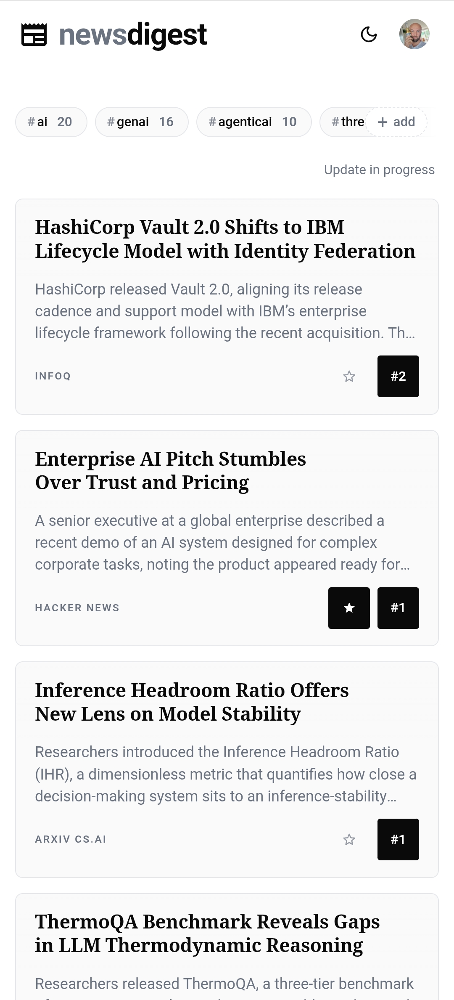
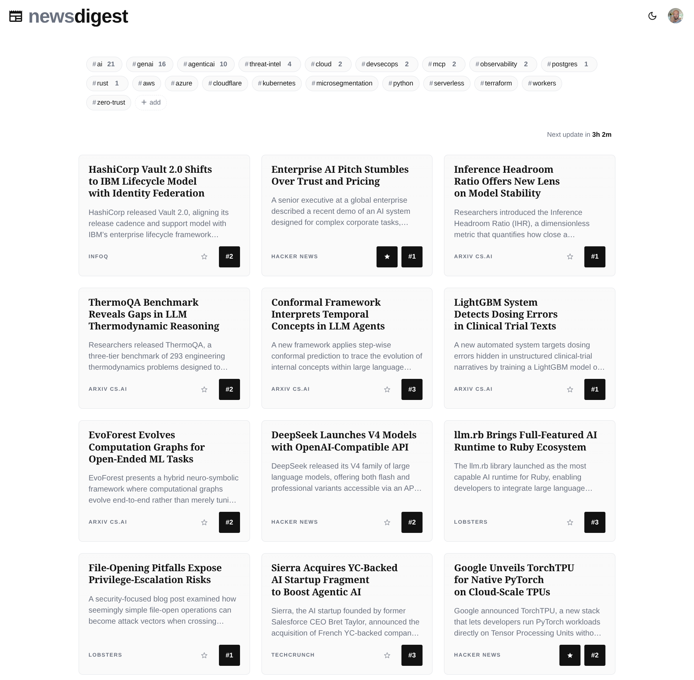
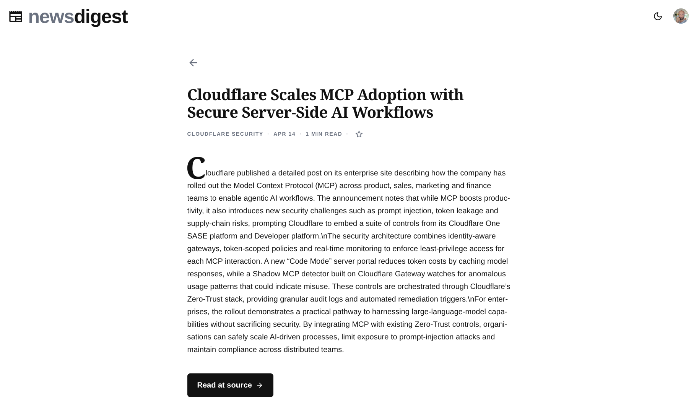

# News Digest

Keeping up with tech news was a part-time job I didn't sign up for, didn't get paid for, and couldn't quit. So I fired myself and hired an LLM — 99% pay cut, zero complaints. Pick your hashtags: it does the reading, you take the credit. You're welcome.

**Live:** <https://news.graymatter.ch> · GitHub sign-in · pick your hashtags · done.

<p align="center">
  
  
  
</p>

## What's in it

- **20 tags preloaded** (`#ai`, `#cloudflare`, `#postgres`, `#agenticai`…). My opinions, helpfully pre-formed for you. Tap × to drop, `+ add` to add.
- **Composable filters on Search & History** — tag + search + date AND together, all in the URL.
- **Multi-source dedupe** — HN, vendor blog, and three aggregators "discovered" the same story? One card, `(+3)` chip.
- **Summaries that earn their word count** — 150–200 words: *what happened → how it works → why you care*.
- **Hallucinations dropped on sight** — every LLM output echoes its candidate index AND shares a real token with the source title. A fabricated summary never reaches the database. (Ask me how I learned that.)
- **Starred articles outlive the cron** — 7-day retention, unless you starred it. Your saved list is forever; your unread list was a lie anyway.
- **One Worker, no servers** — Cloudflare D1 + KV + Queues + Workers AI. Ships in 30 seconds. Rollback is `wrangler rollback`, which I've used more times than I'd like to admit.

## What's *not* in it

No ads. No cookie banner. No paywall. No newsletter pop-up. No auto-playing video. No exit-intent modal. No chat widget asking if it can help me find what I'm looking for (I was looking for the article, which you covered up, with yourself). No tracking pixels, no Hotjar, no A/B paywall experiment.

No fake news either. The LLM summarises real sources and links straight back. If the source is lying, the source is lying — I just put fewer adjectives on it.

The bar for "doesn't spy on you or sell you anything" is, in fairness, embarrassingly low. I cleared it.

## Why

Newsletters arrive on someone else's clock. RSS readers turn into 3,000-item guilt-trips. Social feeds optimise for outrage. Asking an LLM requires remembering to ask.

News Digest hires the LLM. It remembers so you don't. This isn't enlightenment. This is delegation.

## Codeflare SDD test run

Test drive of [Codeflare](https://codeflare.ch) ([repo](https://github.com/nikolanovoselec/codeflare))'s spec-driven workflow. Every feature: spec first (`sdd/{domain}.md`) → failing test → minimal code annotated `// Implements REQ-X-NNN` → review agents on push → auto-deploy on green.

40+ REQs across 10 domains. The review agents are thorough — they caught me trying to write this paragraph without a REQ. [Spec](sdd/README.md) · [Architecture](documentation/architecture.md) · [Changelog](sdd/changes.md)

## Stack

| Layer | Choice |
|---|---|
| Framework | [Astro 5](https://astro.build) on [Cloudflare Workers](https://workers.cloudflare.com) |
| DB / Cache / Queues | [D1](https://developers.cloudflare.com/d1/) · [KV](https://developers.cloudflare.com/kv/) · [Queues](https://developers.cloudflare.com/queues/) |
| LLM | [Workers AI](https://developers.cloudflare.com/workers-ai/): `gpt-oss-120b` primary, `gpt-oss-20b` fallback |
| Email | [Resend](https://resend.com) |
| Auth | GitHub OAuth + HMAC-SHA256 JWT |

## Deploy your own

Three steps. The Deploy workflow takes care of D1, KV, queues, migrations, secret push, and (optional) custom-domain bind. No `wrangler deploy` from your laptop.

### 1. Fork

Click Fork. Pick a name. The default Worker service name is `ai-news-digest`; if you keep that, your URL is `https://ai-news-digest.<your-user>.workers.dev`.

### 2. Set repo secrets

Settings → Secrets and variables → Actions → New repository secret. Add the four required ones — everything else is optional:

| Secret | Required | What it's for |
|---|---|---|
| `CLOUDFLARE_API_TOKEN` | yes | Token with the scopes listed below. |
| `CLOUDFLARE_ACCOUNT_ID` | yes | Find it on any zone overview in the Cloudflare dashboard. |
| `OAUTH_CLIENT_ID` | yes | GitHub OAuth App client id. Create at github.com → Settings → Developer settings → OAuth Apps → New. Authorization callback URL is `<APP_URL>/api/auth/github/callback`. |
| `OAUTH_CLIENT_SECRET` | yes | Generated alongside the client id. Server-side only. |
| `OAUTH_JWT_SECRET` | yes | HMAC key for session cookies. Generate: `openssl rand -base64 32`. Rotating it expires every active session. |
| `APP_URL` | yes | Canonical origin used by the Origin gate and OAuth callback. Use `https://ai-news-digest.<your-user>.workers.dev` if you don't have a custom domain (it works exactly the same — you just give that URL to GitHub when registering the OAuth App). |
| `RESEND_API_KEY` | optional | [Resend](https://resend.com) key for the daily "your digest is ready" email. When unset, digests still generate and appear in the app — only the email step is skipped. |
| `RESEND_FROM` | optional | Sender address (e.g. `News Digest <hello@yourdomain.com>`). Required when `RESEND_API_KEY` is set; ignored when not. |
| `DEV_BYPASS_TOKEN` | optional | Enables `/api/dev/login` for `scripts/e2e-test.sh`. When unset, the endpoint returns 404. |

#### Cloudflare API token scopes

Custom token via [dash.cloudflare.com/profile/api-tokens](https://dash.cloudflare.com/profile/api-tokens):

| Scope | Permission | Access | Why |
|---|---|---|---|
| Account | Workers Scripts | Edit | Deploys the Worker. |
| Account | Workers KV Storage | Edit | Auto-creates the KV namespace if it doesn't exist. |
| Account | D1 | Edit | Auto-creates the D1 database and applies migrations. |
| Account | Queues | Edit | Auto-creates `scrape-coordinator` and `scrape-chunks`. |
| Account | Workers AI | Read | LLM inference for summaries + source discovery. |
| Zone | Zone | Read | Only when binding a custom domain — discovers the zone. |
| Zone | Workers Routes | Edit | Only when binding a custom domain — attaches the hostname. |

The Zone scopes are skipped automatically when `APP_URL` is a `*.workers.dev` URL.

### 3. Deploy

Actions → Deploy → Run workflow → Branch: `main` → **Run workflow**. Takes ~2 minutes. The workflow:

1. Resolves (or creates) the D1 database, KV namespace, and queues in your account via [`scripts/bootstrap-resources.sh`](scripts/bootstrap-resources.sh).
2. Applies D1 migrations.
3. Pushes Worker secrets (Resend pair skipped when unset).
4. `wrangler deploy`.
5. Binds your `APP_URL` hostname to the Worker (skipped when it's a `*.workers.dev` URL).
6. Smoke-tests `GET /` returns 200.

Future pushes to `main` deploy automatically.

### 4. Make the admin endpoints non-public

Three operator endpoints under `/api/admin/*` (force-refresh + re-discover) need an extra gate so other signed-in users can't trigger them. Cloudflare Access at the zone level — [setup walkthrough](documentation/deployment.md#admin-only-routes-cloudflare-access-gating). Only needed if you bound a custom domain; on `*.workers.dev` your account is already the only signed-in user.

## Local dev

```bash
npm install
npx wrangler d1 migrations apply DB --local
npm run dev
```

Copy `.dev.vars.example` to `.dev.vars`, add GitHub OAuth client ID + secret and a random `OAUTH_JWT_SECRET` (≥32 bytes).

## License

MIT.
